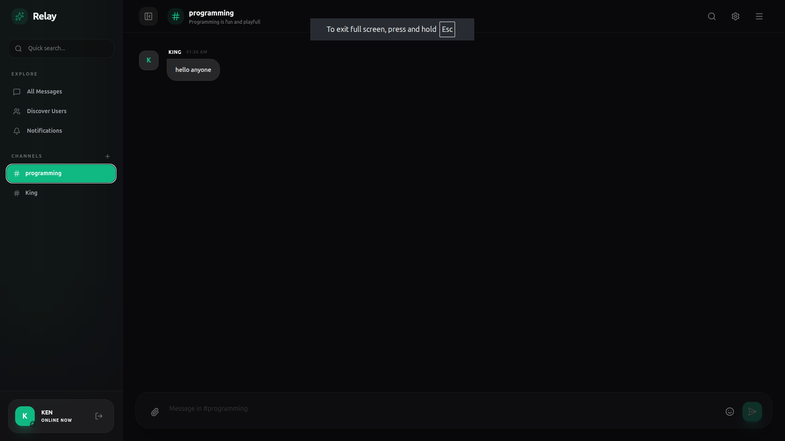
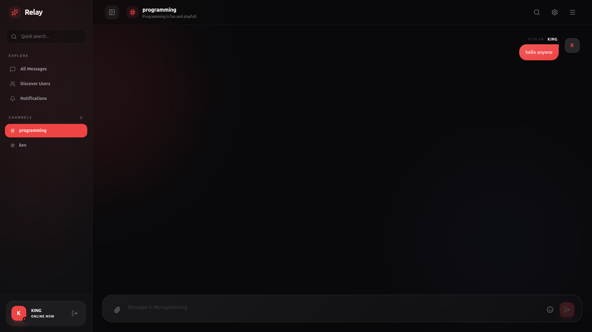

# Relay 🚀

**Relay** is a premium, real-time chat application designed for high-end digital communication. Built with a modern full-stack architecture, it combines sophisticated aesthetics with powerful real-time capabilities.




## ✨ Features

- **Real-time Messaging**: Instant communication powered by Socket.io.
- **Advanced Room Moderation**: Create forums, manage members (add/kick), and assign administrative roles.
- **DM Invitations**: Discover users and send invitations to start private conversations.
- **Real-time Notifications**: Visual toasts and sound alerts for incoming messages and invitations.
- **Interactive Metadata**: Dynamic room/DM descriptions that sync across all clients in real-time.
- **Premium Glassmorphic UI**: High-end design with animated mesh gradients and unified settings access.
- **Intelligent Search**: Real-time message filtering with keyword highlighting.
- **Personalized Profiles**: Manage your identity with custom usernames and avatars.
- **Typing Presence**: Real-time feedback showing when colleagues are active.

## 🛠 Tech Stack

### Frontend

- **React 19** (Vite context)
- **Tailwind CSS 4** (Modern styling)
- **Framer Motion** (Premium animations)
- **Lucide React** (Vector iconography)
- **React Hot Toast** (Real-time notifications)
- **Axios** (API communication)

### Backend

- **Node.js & Express**
- **Socket.io** (WebSockets)
- **Prisma ORM** (Database management)
- **PostgreSQL** (Primary persistence)
- **Redis** (Infrastructure health)
- **JWT & Bcrypt** (Security)

---

## 🚀 Getting Started

### 📦 Quick Start with Docker (Recommended)

The easiest way to get Relay up and running is using Docker:

1. **Clone the Repository**
2. **Launch Containers**:

   ```bash
   docker-compose up --build
   ```

3. **Access the App**: Navigate to `http://localhost:3000` in your browser.

---

## 🏗 Project Structure

```text
chat-app/
├── backend/            # Express server, Prisma models, Socket handlers
├── frontend/           # React application, Tailwind styles, API hooks
├── docker-compose.yml  # Full orchestrated environment
└── README.md           # You are here
```

## 📜 License

This project is licensed under the ISC License.
